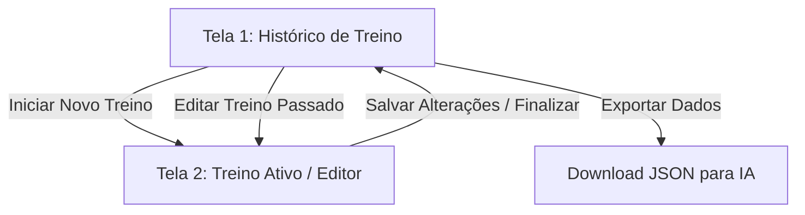

# Escrutínio de Ideia e Domínio: Meu Treino 🏋️‍♂️

O projeto **Meu Treino** é uma ferramenta pessoal minimalista desenvolvida para rastrear treinos de musculação de forma ágil, sem fricção e sem rigidez, assemelhando-se à simplicidade de um bloco de notas digital, mas com automações locais úteis.

---

## 1. Filosofia: Interface Plana (Modo Claro & Sem Firulas)

A interface deve ser extremamente direta, limpa e focado no contraste (Light Mode padrão):
- **Visual Clássico:** Fundo claro (branco/cinza claro), textos escuros e inputs bem delimitados.
- **Zero Fricção:** Menos toques possíveis. Ao iniciar um exercício, as séries e cargas anteriores são exibidas discretamente para servir de base direta.
- **Instalação como PWA:** Suporte a Progressive Web App para permitir a instalação do aplicativo na tela inicial do celular, rodando em tela cheia (sem a barra de navegação) e funcionando offline.

---

## 2. Estrutura de Dados Flexível

Ao contrário de apps engessados, o domínio deste projeto permite total flexibilidade:

### A. Estrutura do Exercício e Cargas por Série
- **Cargas Individuais:** O peso não é global. Cada série de um exercício possui seu próprio campo de carga (peso em KG), repetições e descanso. É possível subir ou descer a carga entre as séries.
- **Quantidade de Séries Dinâmica:** O usuário pode adicionar novas séries ou remover séries existentes (`X`) a qualquer momento durante o treino ativo.
- **Auto-preenchimento Inteligente:** Ao adicionar uma nova série, o aplicativo pré-preenche **apenas a Carga (Peso) e o Tempo de Descanso** com base na série anterior. O campo de **Repetições** começa limpo/vazio para digitação, pois as repetições variam muito de série para série e o preenchimento automático causaria mais fricção do que ajuda.

### B. Técnicas Avançadas por Série
- **Tags de Técnicas:** Botões rápidos (pills) para associar técnicas avançadas à série:
  - `RP` (Rest-Pause)
  - `DS` (Drop Set)
  - `FS` (Failure Set / Até a Falha)
  - `ISO` (Isometria)
- O usuário pode aplicar as técnicas a séries específicas à medida que as adiciona.

### C. Notas Pessoais
- Campo de texto simples associado a cada exercício para anotações rápidas e lembretes de execução (ex: *"Observações do exercício..."*).

---

## 3. Cronômetro de Descanso Progressivo e Manual

O controle de tempo é desenhado para não gerar ansiedade ou rigidez:
- **Sem Alarmes Invasivos:** O aplicativo não emite sons ou vibrações ao fim de tempos rígidos.
- **Stopwatch Progressivo:** O cronômetro de descanso (stopwatch) inicia em `00:00` automaticamente quando o usuário adiciona uma nova série ou quando clica em um botão de play discreto associado ao timer.

- **Controle Manual:** O usuário acompanha os segundos passados na tela. Ao se sentir pronto para a próxima série, o timer pode ser resetado manualmente com um toque ou reiniciado na próxima adição de série.

---

## 4. O Fluxo de Telas (Duas Telas Principais)



### Tela 1: Histórico de Treino (Tela Inicial)
- **Lista Cronológica:** Exibição simples dos treinos passados (Data, Duração, Exercícios realizados).
- **Modo Editor (Coringa):** Ao clicar em "Editar" em um treino passado, o app redireciona o usuário para a **Tela 2 (Treino Ativo)** em modo de edição, permitindo modificar qualquer dado do passado e salvar.
- **Ações Rápidas:**
  - *Iniciar Treino em Branco:* Começa uma sessão sem exercícios.
  - *Repetir Último Treino:* Copia os exercícios e dados do último treino do histórico para a tela ativa.
  - *Gerenciar Templates:* Abre uma lista simples de templates criados (ex: "Treino Peito 1", "Treino Costas 2"). Clicar em um template inicia o treino ativo com os exercícios pré-carregados.
- **Gerenciamento de Dados:** Exportação e importação do arquivo `meu_treino_backup.json` local.

### Tela 2: Treino Ativo (Tela Coringa)
- **Cabeçalho da Sessão:** Exibe a data/hora do treino, o tempo decorrido, o status ("Em andamento") e o botão vermelho "Encerrar" (ou "Salvar Alterações" no modo edição).
- **Cues da Sessão (Lembretes Globais):** Caixa de texto no topo para adicionar lembretes gerais ("SEMPRE SEGURAR 3s").
- **Lista de Exercícios Colapsáveis:** Os exercícios do treino aparecem como cards. Em modo colapsado, mostra apenas o nome do exercício e um resumo (ex: *"Supino Reto - 1 série: 12"*).
- **Estrutura Expandida do Exercício:**
  - *Nome:* Campo de texto editável com o nome do exercício.
  - *Carga (kg):* Campo de carga de referência geral.
  - *Notas:* Área de texto para dicas de execução específicas daquele movimento.
  - *Séries Registradas:* Uma lista numerada das séries já realizadas (ex: `1. 12 reps @ 30kg - 120s [X]`).
  - *Edição/Adição de Séries (Fila de Entrada):*
    - Botões rápidos de ajuste rápido de repetições: `[Mesmas reps]`, `[-1 rep]` e `[+1 rep]`.
    - Inputs lado a lado: `[ Reps ]`, `[ Carga kg ]`, `[ Tempo Descanso (s) ]` e o botão azul `[+]` para adicionar.
    - Seletor de Técnicas Avançadas: Pills arredondadas (`FS`, `RP`, `DS`, `ISO`) logo abaixo para selecionar quais técnicas se aplicam à série antes de criá-la.
- **Adicionar Exercício:** Um botão azul proeminente no rodapé da página `+ Adicionar exercício`.


---

## 5. Exportação e Armazenamento (Otimizado para IA)

- **Offline-First:** Armazenamento local puro no navegador (LocalStorage ou IndexedDB). Sem servidores, sem nuvem, sem login.
- **JSON Estruturado:** A exportação gera um arquivo JSON plano e limpo para que qualquer IA possa interpretar o progresso do usuário no futuro.

### Modelo de Objeto JSON de Treino:
```json
{
  "id": "UUID",
  "date": "2026-08-02T21:23:09Z",
  "durationInSeconds": 3600,
  "name": "Treino A (Opcional - Nome do Template ou Livre)",
  "cues": ["Manter escápulas aduzidas"],
  "isTemplate": false,
  "status": "completed",
  "exercises": [
    {
      "id": "UUID-EXERCICIO",
      "name": "Supino Inclinado",
      "weightInKg": 30,
      "notes": "Diminuir o peso na descida",
      "sets": [
        {
          "weightInKg": 30,
          "repetitions": 11,
          "restTimeInSeconds": 120,
          "advancedTechniques": ["RP"]
        },
        {
          "weightInKg": 30,
          "repetitions": 10,
          "restTimeInSeconds": 120,
          "advancedTechniques": []
        },
        {
          "weightInKg": 28,
          "repetitions": 9,
          "restTimeInSeconds": 120,
          "advancedTechniques": ["ISO"]
        }
      ]
    }
  ]
}
```
